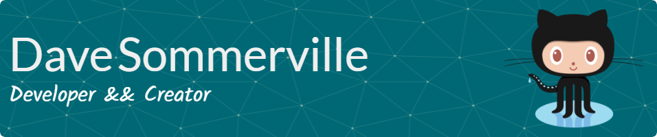

## About Me
Hi, I'm Dave! I'm a proud Winnipegger currently enrolled in Fullstack Software Development at Manitoba Institute of Trades and Technology.  
I love making things, and now I love making things for the web. Although I've just begun my web dev journey, I'm already obsessed with the possibilities.  
As a student, I'm dedicating myself to learning and getting all the hands-on experience I possibly can. If you're interested in my work or think I might be someone to collaborate with, please reach out and let me know!
## Project Examples
- [Portfolio Website](https://ds-code.ca): A more in-depth look at my skills and experience. 
- [Script Scavengers](https://dave-sommerville.github.io/script-scavengers/): My most extensive game design... so far.
- [Me, Myself, & Eye](https://dave-sommerville.github.io/social-media-app/): My first social media site design.  
- [Blackjack](https://dave-sommerville.github.io/blackjack/): My first and most continually evolving project
### What I'm working with now

### What I'm working with soon

### Github Stats 📈

### Say Hi 👋

