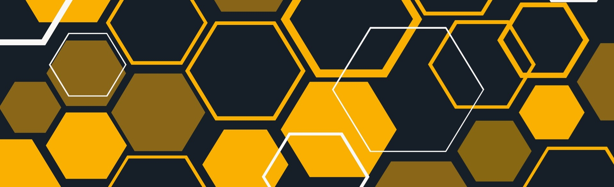

## About Me
Hello world, it's Dave. I'm a recent Fullstack Software Development graduate from Manitoba Institute of Trades and Technology in Winnipeg.  
I have spent the past year with my imagination and my fingers going wild creating new things and turning script into reality. I'm in love. 
I'm proud to highlight most of my work on my personal site [DS Code](https://ds-code.ca) and my largest project (for now) is [Blackjack](https://dave-sommerville.github.io/blackjack/)
I also welcome collaboration; so if you see anything in my future plans below or if you have a project of your own you'd like my spin on, 
please reach out to me [here](mailto:dave.r.sommerville@outlook.com). 

### My Languages
Proficient: 
- HTML/CSS
- JavaScript
- C#
- SQL

Familiar:
- Git
- Node.js
- React
- PHP

### Vision Board
Current Projects:
- C# Console App Dungeon Crawler
- Freelance Web Project

Future Plans
- Minesweeper clone
- Basic paint editor
- Battleship clone (AI and multiplayer)
- Experimenting with unexplored DOM elements (camera, geolocation, touchscreen, etc)
- Grocery/Menu tracking API

#### My Favourite Resoures 
🌟 Learning by Play
- [SQLPD – SQL Puzzle Database](https://sqlpd.com/?ref=dailydev) - Practice SQL through interactive puzzle challenges.
- [Teachable Machine by Google](https://teachablemachine.withgoogle.com/) - Train machine learning models with no coding required.
- [Flexbox Froggy](https://flexboxfroggy.com/) - A fun game to learn CSS Flexbox layout.

📚 Favorite Resources
- [Flaticon](https://www.flaticon.com) – Free icons for your projects.  
- [CSS Grid Generator](https://cssgridgenerator.io/) – Visual tool to create CSS Grid layouts.  
- [ReadMe.so](https://readme.so/) – Easily create beautiful README files.  
- [Shields.io](https://shields.io/badges) – Customizable badges for GitHub projects.  
- [Figma](https://figma.com) – Collaborative interface design tool.

💡 Project Inspiration
- [Web Dev Mini Projects by Ayush Parikh](https://github.com/Ayushparikh-code/Web-dev-mini-projects)  
  A great collection of beginner-friendly web development mini projects.

#### Github Stats 📈

## Say Hi 👋

&nbsp;&nbsp;

